# CLOSE — System Architecture

CLOSE is an AI Finance Controller engineered for deterministic financial precision, transparent AI investigations, auditable evidence lineages, and forward-looking cash forecasting.

## Architecture Diagram

```mermaid
flowchart TB
    subgraph ClientLayer ["Client Layer (Next.js 15 App Router)"]
        UI_Landing["Landing Page (/)"]
        UI_Dash["Command Center (/dashboard)"]
        UI_Batches["Batch Processing (/batches)"]
        UI_Recon["Matching Matrix (/reconciliation)"]
        UI_Exceptions["Evidence Room (/exceptions/[id])"]
        UI_Cash["Cash Forecast (/cash-position)"]
        UI_Eval["Ground-Truth Eval (/evaluation)"]
        UI_Audit["Audit Trail (/audit-log)"]
    end

    subgraph APILayer ["API Layer (FastAPI)"]
        Router_Auth["/api/auth/*"]
        Router_Batches["/api/batches/*"]
        Router_Uploads["/api/uploads/*"]
        Router_Recon["/api/reconciliation/*"]
        Router_Exceptions["/api/exceptions/*"]
        Router_Cash["/api/cash-position/*"]
        Router_Eval["/api/evaluation/*"]
        Router_Audit["/api/audit-logs/*"]
    end

    subgraph CoreEngine ["Reconciliation & Intelligence Core"]
        Normalizer["Data Normalizer (Dates, Currencies, Standard Ref)"]
        ExactMatcher["Exact Matcher (Reference, Account, Amount)"]
        ToleranceMatcher["Tolerance & Fee Matcher (Discrepancy <= Fee Range)"]
        FuzzyMatcher["Fuzzy Description Matcher (Token Sort Ratio)"]
        DuplicateDetector["Duplicate & Anomaly Detector"]
        AIAgent["AI Finance Investigator (LLM / Structured JSON)"]
        ForecastEngine["Deterministic Cash Forecaster"]
        EvalEngine["Ground-Truth Benchmark Calculator"]
    end

    subgraph DataLayer ["Data & Storage Layer"]
        DB[(PostgreSQL / SQLite via SQLAlchemy ORM)]
        FileStore["Storage Bucket (CSVs / Invoices / Settlements)"]
        AuditLogStore["Append-Only Audit Log"]
    end

    ClientLayer <-->|REST API JSON| APILayer
    APILayer --> CoreEngine
    CoreEngine --> DataLayer
```

## Architectural Principles

1. **Deterministic Logic First**: All exact amounts, references, date comparisons, and duplicate detections are calculated using deterministic Python and Pandas algorithms. The LLM is NEVER used for arithmetic or proven matches.
2. **AI for Ambiguity Only**: The AI investigator is invoked only when records exhibit ambiguous discrepancies (e.g., suspected processor fees, name variations, split payments).
3. **Evidence-Linked Decisions**: The AI must produce structured Pydantic schemas citing exact record IDs. Decisions lacking supporting evidence are classified as `UNRESOLVED` requiring human review.
4. **Honest Ground-Truth Benchmarks**: Metrics (Precision, Recall, F1, Auto-resolution Precision, False-resolution rate) are calculated against hidden ground truth labels, not synthetic estimates.
5. **Fail-Safe Offline Mode**: With `AI_MODE=mock`, the system runs completely offline for testing, hackathon evaluation, and CI pipelines with 100% deterministic fidelity.
